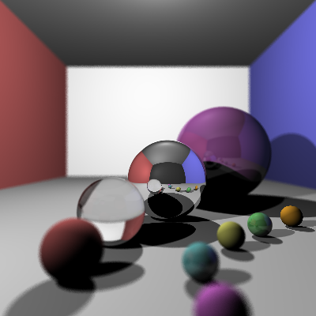

# COMP30019 - Ray Tracer

**Name:** Andy Jun Cheng Low \
**Student Number:** 1136438 \
**Username:** ANDYJUNCHENG \
**Email:** andyjuncheng@student.unimelb.edu.au

## Completed stages

<!---
Tip: To tick, place an x between the square brackes [ ], like so: [x]
-->

##### Stage 1

- Implement vector mathematics
- Fire a ray for each pixel
- Calculate ray-entity intersections
- Output primitives as solid colours

<p float="left">
  
</p>

##### Stage 2

- Diffuse materials
- Shadow rays
- Reflective materials
- Refractive materials
- The Fresnel effect
- Anti-aliasing

<p float="left">
  
   
</p>

##### Stage 3 - Add-ons

- [ ] Option A - Emissive materials 
- [ ] Option B - Ambient lighting/occlusion 
- [ ] Option C - OBJ models 
- [x] Option D - Glossy materials 
- [ ] Option E - Custom camera orientation 
- [x] Option F - Beer's law 
- [x] Option G - Depth of field 

- (Glossy Materials) Glossy materials have a reflective component and a diffuse component, we choose a suitable ratio between the two to obtain the desired glossy effect
- (Beer's Law) Calculate the light absorbance of a material, depending on the color obsorbence of the material
- (Depth of field) Shoot a ray through the pixel with a fixed focal length to find the focal point, fire multiple random rays within a circle about the camera determined by the aperture size throught the focal point and obtain an average color

## Final scene render



Rendering time **10** minutes and **13** seconds.

With the following command:

```
dotnet run -- -f tests/final_scene.txt -o output.png --aperture-radius 0.01 --focal-length 0.8
```

## Sample outputs

###### Sample 1

```
dotnet run -- -f tests/sample_scene_1.txt -o images/sample_scene_1.png -x 4
```

<p float="left">
  
   
</p>

###### Sample 2

```
dotnet run -- -f tests/sample_scene_2.txt -o images/sample_scene_2.png -x 4
```

<p float="left">
  
   
</p>

## References
- Basic ray tracing - https://www.scratchapixel.com/lessons/3d-basic-rendering/introduction-to-ray-tracing
- Depth of field - https://stackoverflow.com/questions/13532947/references-for-depth-of-field-implementation-in-a-raytracer
- Beer's law - https://www.flipcode.com/archives/Raytracing_Topics_Techniques-Part_3_Refractions_and_Beers_Law.shtml


